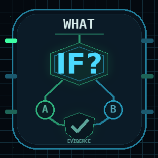
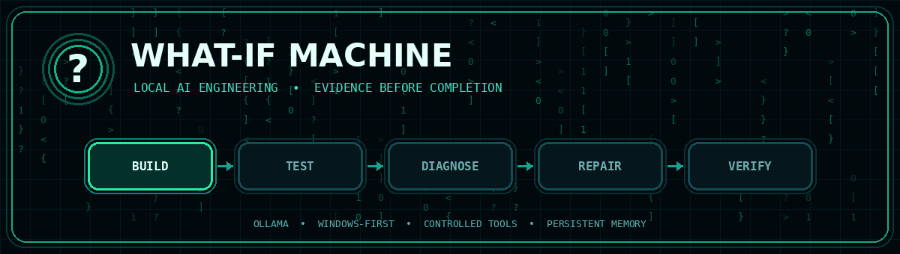
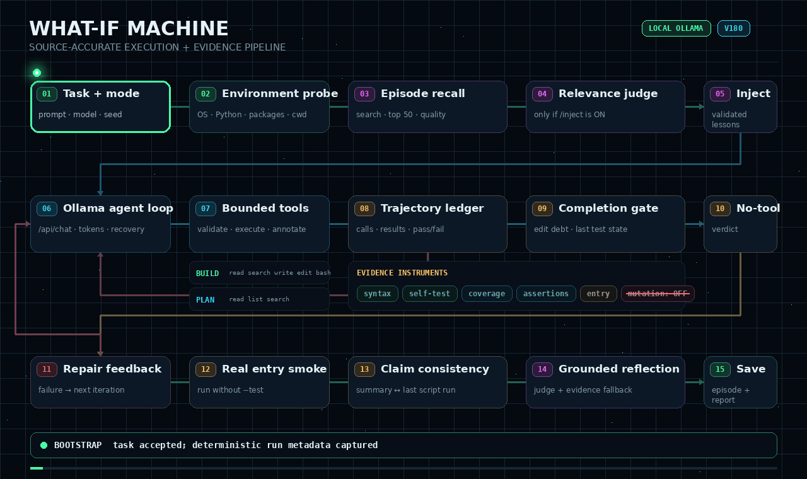
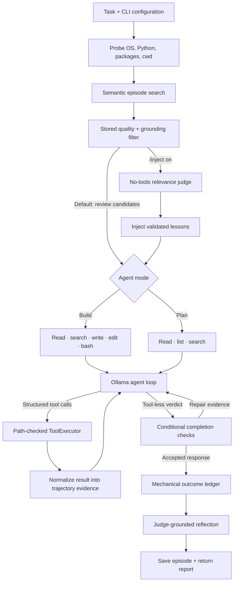

<div align="center">

  

  # What-If Machine

  **Local AI engineering that treats evidence—not confidence—as completion.**

  A Windows-first Ollama agent that can plan, build, test, diagnose, repair, and verify software inside a controlled workspace.

  [](https://www.python.org/)
  [](https://www.microsoft.com/windows/windows-11)
  [](https://ollama.com/)
  [](https://github.com/Astroqbit/what-if-machine/actions/workflows/bandit.yml)
  
  [](LICENSE)

  <br>

  

  [Quick start](#quick-start) · [How it works](#how-it-works) · [Verification](#verification-stack) · [Models](#model-compatibility) · [Documentation](#documentation) · [Security](SECURITY.md)

</div>

> [!NOTE]
> **Experimental portfolio release.** The runtime is under active development and full behavior depends on the selected model, local environment, dependencies, and task. It is an engineering tool—not a hardened security sandbox.

## Why it exists

Most coding agents can stop when an answer *looks* complete. What-If Machine is designed around a stricter question:

> **What evidence shows that the result actually works?**

The agent gives a local model structured tools, records what really happened, challenges weak success signals, and feeds failures back into the next iteration. The result is a repeatable **build → test → diagnose → repair → verify** loop instead of a one-shot code response.

## Highlights

| | Capability | | Capability |
|---|---|---|---|
| 🛠️ | **Build mode** modifies files and executes bounded developer commands. | 🔎 | **Plan mode** inspects projects without changing them. |
| ✅ | **Evidence-oriented verification** checks syntax, runtime behavior, coverage, assertions, and completion claims. | 🔁 | **Failure recovery** turns failed tools and tests into actionable evidence for the next pass. |
| 🧠 | **Episode memory** preserves outcomes, root causes, fixes, settings, and optional embeddings. | 🎲 | **Reproducible runs** record model, seed, temperature, token use, and Ollama version. |
| 🖥️ | **Live terminal dashboard** shows status, context use, tool history, memory, and Matrix-style activity. | 🔒 | **Workspace boundaries** add path validation, command allowlisting, timeouts, and destructive-pattern blocking. |
| 🏠 | **Local-first operation** uses an Ollama endpoint instead of requiring a hosted AI API. | 📋 | **Detailed run logs** preserve evidence that may be condensed in the live terminal. |

## How it works

<div align="center">
  
</div>

What-If Machine is not a single prompt followed by a best-effort answer. It is a bounded, evidence-carrying control loop. Before work begins, it probes the local environment and searches prior episodes for lessons; while work is running, every tool result updates a trajectory ledger; when the model tries to finish, mechanical checks compare that verdict with what actually ran.



### The control loop, precisely

| Stage | What the current source does | Evidence carried forward |
|---|---|---|
| **Bootstrap** | Builds separate builder and pinned judge clients, probes the workspace, and exposes tools according to Build or Plan mode. | Model, seed, temperature, Ollama version, platform facts, and allowed tool schemas. |
| **Recall** | Searches episode embeddings for up to 50 candidates and drops low-quality or ungrounded records. When `/inject` is on, the no-tools judge decides which lessons transfer; injection is off by default for review. | Candidates remain reviewable; only judge-validated lessons enter system context when injection is enabled. |
| **Think → act** | Calls Ollama's `/api/chat`; structured calls pass through path validation, a command allowlist, timeouts, duplicate suppression, and destructive-pattern checks. | Actual arguments, normalized results, success state, token counts, and retained reasoning for later review. |
| **Diagnose → repair** | Tool failures, red tests, edit spirals, assertion weakening, silent exception swallowing, stalls, and protocol errors produce bounded corrective feedback instead of being mistaken for progress. | The next iteration sees the measured failure and the relevant repair instruction. |
| **Verify completion** | A tool-less answer can trigger edit/test-debt checks, coverage and assertion feedback, a real entry-point smoke run, and a final-claim check. Applicable failures feed back into the loop. | Passing and failing test order, latest edits, script outcomes, coverage snapshots, smoke results, and claim conflicts remain distinct. |
| **Finish → learn** | Mechanical rules can downgrade an unsupported success. The pinned judge creates an evidence-grounded reflection, with a code-derived fallback if needed, and the full episode is stored. | Outcome, root cause, fix, verification, confidence, grounding, trajectory, settings, tokens, thinking log, and optional embedding. |

> [!IMPORTANT]
> Checks are conditional on the artifact and the evidence available in that run. Mutation-testing infrastructure exists, but the current V180 source sets `MUTATION_MAX_FIRES = 0`, so mutation rounds are disabled by default.

### Built-in tools

| Tool | Purpose | Build | Plan |
|---|---|:---:|:---:|
| `file_read` | Read a bounded section of a file | ✓ | ✓ |
| `list_dir` | Inspect workspace structure | ✓ | ✓ |
| `grep_search` | Search project text | ✓ | ✓ |
| `file_write` | Create a new file | ✓ | — |
| `str_replace` | Make a targeted edit | ✓ | — |
| `bash` | Run allowlisted developer commands | ✓ | — |

Read the deeper design notes in [Architecture](docs/ARCHITECTURE.md).

## Quick start

### 1. Install the prerequisites

- Windows 11 (primary development target)
- [Python 3.10+](https://www.python.org/downloads/)
- [Ollama](https://ollama.com/download)
- An Ollama model with reliable tool/function calling

### 2. Clone and install

```powershell
git clone https://github.com/Astroqbit/what-if-machine.git
cd what-if-machine
python -m pip install -r requirements.txt
```

### 3. Pull a model

The preferred public Ornith model is:

```powershell
ollama pull ornith:35b
```

### 4. Run the machine

Interactive Build mode:

```powershell
New-Item -ItemType Directory -Force C:\work\mission | Out-Null
python what_if_machine.py --model ornith:35b --dir C:\work\mission
```

Single-prompt mode:

```powershell
python what_if_machine.py --model ornith:35b --dir C:\work\mission "Build a small Python utility and verify it."
```

Read-only planning:

```powershell
python what_if_machine.py --agent plan --model ornith:35b --dir C:\work\mission
```

<details>
<summary><strong>CLI options</strong></summary>

| Option | Description |
|---|---|
| `prompt` | Optional prompt for non-interactive execution |
| `--model`, `-m` | Ollama model tag |
| `--agent`, `-a` | `build` or `plan` |
| `--url`, `-u` | Ollama endpoint |
| `--dir`, `-d` | Bounded working directory |
| `--temp`, `-t` | Builder temperature; default `0.6` |
| `--seed` | Reuse a recorded builder seed for a closer replay |
| `--verbose`, `-v` | Show additional diagnostic output |
| `--log FILE` | Write the uncapped run log to a chosen file |
| `--no-log` | Disable run logging |

</details>

## Verification stack

What-If Machine separates checks that are often incorrectly treated as equivalent:

| Layer | Question it answers |
|---|---|
| **Parse** | Is the file syntactically valid? |
| **Runtime** | Does the real entry point start? |
| **Self-test** | Does an explicit verification path pass? |
| **Coverage** | Did the relevant code and assertions execute? |
| **Assertion quality** | Is the test meaningful rather than decorative? |
| **Mutation** | Would selected incorrect behavior be detected? |
| **Completion ledger** | Do final claims agree with recorded execution evidence? |

No single green signal proves everything. The runtime combines multiple imperfect measurements and keeps their evidence distinct.

> [!IMPORTANT]
> Mutation-testing infrastructure is present, but mutation-gate firings are disabled by default in the current V180 source with `MUTATION_MAX_FIRES = 0`.

See [Verification Design](docs/VERIFICATION.md) and the measured [Engineering Case Studies](docs/ENGINEERING_CASE_STUDIES.md).

## Model compatibility

The runtime communicates with Ollama's `/api/chat` endpoint and supplies structured tool definitions. A suitable model must reliably follow tool schemas across long, iterative sessions.

| Family | Example Ollama tags | Position |
|---|---|---|
| **Ornith 1.5** | `ornith-1.5:35b`, `ornith-1.5:9b` | work-in-progress family |
| **Ornith 1.0** | `ornith:35b`, `ornith:9b` | Compatible Release |

These are interface-compatible candidates, not a claim that every model and quantization has been benchmarked end to end. See [Model Compatibility](docs/MODELS.md).

## Persistent data

| Path | Contents |
|---|---|
| `episodes.jsonl` | Tasks, outcomes, lessons, root causes, evidence, model settings, and optional embeddings |
| `whatif_logs/` | Uncapped run logs stored beside the runtime by default |
| Mission workspace | Files and other artifacts produced during a build |

Prompts, paths, model output, and tool evidence may appear in the episode store and logs. Both supplied runtime-data paths are excluded by `.gitignore`; still review them before sharing a workspace.

## Safety

The project contains engineering guardrails, not an operating-system security boundary. Commands and generated programs inherit the permissions of the account running What-If Machine.

1. Run each mission in a dedicated workspace.
2. Keep credentials and private files outside that workspace.
3. Use version control or backups for important projects.
4. Use a disposable VM or container for untrusted code, packages, prompts, or models.
5. Review dependency-install commands in sensitive environments.

Read the full [Security Policy](SECURITY.md).

## Project status

| | Current state |
|---|---|
| Maturity | Experimental portfolio release |
| Primary platform | Windows 11 |
| Interface | Python CLI with a Rich live dashboard and plain-terminal fallback |
| Runtime | Local or reachable Ollama endpoint |
| Verification | Multi-layer checks; task- and environment-dependent |

<details>
<summary><strong>Known limitations and active cleanup</strong></summary>

- Some displayed version labels and documentation are not yet synchronized with the V180 source header.
- Theme colors, terminal sizing, and border behavior may vary with terminal configuration.
- Some documented or planned features may not yet be wired through every execution path.
- Long model sessions can time out, and dependencies vary by generated project.
- Model behavior is not uniform even when the Ollama interface reports tool support.
- Full model-driven verification depends on the task, generated artifact, local dependencies, and available hardware.

</details>

## Documentation

| Document | What it covers |
|---|---|
| [Architecture](docs/ARCHITECTURE.md) | Runtime components, tools, memory, logging, and data flow |
| [Verification Design](docs/VERIFICATION.md) | Verification layers and their limits |
| [Engineering Case Studies](docs/ENGINEERING_CASE_STUDIES.md) | Observed failure modes and measured repairs |
| [Model Compatibility](docs/MODELS.md) | Model families, Ollama tags, endpoints, and reproducibility |
| [GitHub Setup](docs/GITHUB_SETUP.md) | Repository setup notes |
| [Security Policy](SECURITY.md) | Threat model and safe-use guidance |

## Contributing

Bug reports and reproducible failure cases are welcome. When reporting a model-driven issue, include the model tag, Ollama version, command, relevant run-log excerpt, and the smallest workspace that reproduces the behavior.

Because this is proprietary software, do not submit code or documentation changes unless Matthew Newland has approved the contribution in writing. See [Contributing](CONTRIBUTING.md) for the ownership policy.

[Open an issue](https://github.com/Astroqbit/what-if-machine/issues/new) · [View the source](what_if_machine.py)

## License

Copyright © 2026 Matthew Newland. All rights reserved.

What-If Machine is **proprietary, source-available software**, not open-source software. No permission is granted to use, copy, modify, distribute, sublicense, sell, host, or create derivative works except under a separate written agreement from the copyright owner. See the [Proprietary License](LICENSE).

## Author

**Matthew Newland** · Technical Research · AI Systems · Verification · QA · Python

If this project is useful, consider [starring the repository](https://github.com/Astroqbit/what-if-machine) so others can find it.
