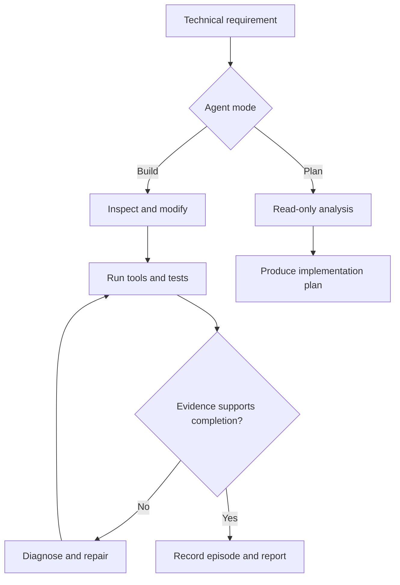

<div align="center">

  

  # What-If Machine

  **Local AI engineering that treats evidence—not confidence—as completion.**

  A Windows-first Ollama agent that can plan, build, test, diagnose, repair, and verify software inside a controlled workspace.

  [](https://www.python.org/)
  [](https://www.microsoft.com/windows/windows-11)
  [](https://ollama.com/)
  [](https://github.com/Astroqbit/what-if-machine/actions/workflows/bandit.yml)
  

  <br>

  

  [Quick start](#quick-start) · [How it works](#how-it-works) · [Verification](#verification-stack) · [Models](#model-compatibility) · [Documentation](#documentation) · [Security](SECURITY.md)

</div>

> [!NOTE]
> **Experimental portfolio release.** The runtime is under active development and full behavior depends on the selected model, local environment, dependencies, and task. It is an engineering tool—not a hardened security sandbox.

## Why it exists

Most coding agents can stop when an answer *looks* complete. What-If Machine is designed around a stricter question:

> **What evidence shows that the result actually works?**

The agent gives a local model structured tools, records what really happened, challenges weak success signals, and feeds failures back into the next iteration. The result is a repeatable **build → test → diagnose → repair → verify** loop instead of a one-shot code response.

## Highlights

| | Capability | | Capability |
|---|---|---|---|
| 🛠️ | **Build mode** modifies files and executes bounded developer commands. | 🔎 | **Plan mode** inspects projects without changing them. |
| ✅ | **Evidence-oriented verification** checks syntax, runtime behavior, coverage, assertions, and completion claims. | 🔁 | **Failure recovery** turns failed tools and tests into actionable evidence for the next pass. |
| 🧠 | **Episode memory** preserves outcomes, root causes, fixes, settings, and optional embeddings. | 🎲 | **Reproducible runs** record model, seed, temperature, token use, and Ollama version. |
| 🖥️ | **Live terminal dashboard** shows status, context use, tool history, memory, and Matrix-style activity. | 🔒 | **Workspace boundaries** add path validation, command allowlisting, timeouts, and destructive-pattern blocking. |
| 🏠 | **Local-first operation** uses an Ollama endpoint instead of requiring a hosted AI API. | 📋 | **Detailed run logs** preserve evidence that may be condensed in the live terminal. |

## How it works



### Built-in tools

| Tool | Purpose | Build | Plan |
|---|---|:---:|:---:|
| `file_read` | Read a bounded section of a file | ✓ | ✓ |
| `list_dir` | Inspect workspace structure | ✓ | ✓ |
| `grep_search` | Search project text | ✓ | ✓ |
| `file_write` | Create a new file | ✓ | — |
| `str_replace` | Make a targeted edit | ✓ | — |
| `bash` | Run allowlisted developer commands | ✓ | — |

Read the deeper design notes in [Architecture](docs/ARCHITECTURE.md).

## Quick start

### 1. Install the prerequisites

- Windows 11 (primary development target)
- [Python 3.10+](https://www.python.org/downloads/)
- [Ollama](https://ollama.com/download)
- An Ollama model with reliable tool/function calling

### 2. Clone and install

```powershell
git clone https://github.com/Astroqbit/what-if-machine.git
cd what-if-machine
python -m pip install -r requirements.txt
```

### 3. Pull a model

The preferred public Ornith model is:

```powershell
ollama pull ornith:35b
```

### 4. Run the machine

Interactive Build mode:

```powershell
python what_if_machine.py --model ornith:35b
```

Single-prompt mode:

```powershell
python what_if_machine.py --model ornith:35b "Build a small Python utility and verify it."
```

<details>
<summary><strong>CLI options</strong></summary>

| Option | Description |
|---|---|
| `prompt` | Optional prompt for non-interactive execution |
| `--model`, `-m` | Ollama model tag |
| `--agent`, `-a` | `build` or `plan` |
| `--url`, `-u` | Ollama endpoint |
| `--dir`, `-d` | Bounded working directory |
| `--temp`, `-t` | Builder temperature; default `0.6` |
| `--seed` | Reuse a recorded builder seed for a closer replay |
| `--verbose`, `-v` | Show additional diagnostic output |
| `--log FILE` | Write the uncapped run log to a chosen file |
| `--no-log` | Disable run logging |

</details>

## Verification stack

What-If Machine separates checks that are often incorrectly treated as equivalent:

| Layer | Question it answers |
|---|---|
| **Parse** | Is the file syntactically valid? |
| **Runtime** | Does the real entry point start? |
| **Self-test** | Does an explicit verification path pass? |
| **Coverage** | Did the relevant code and assertions execute? |
| **Assertion quality** | Is the test meaningful rather than decorative? |
| **Mutation** | Would selected incorrect behavior be detected? |
| **Completion ledger** | Do final claims agree with recorded execution evidence? |

No single green signal proves everything. The runtime combines multiple imperfect measurements and keeps their evidence distinct.

> [!IMPORTANT]
> Mutation-testing infrastructure is present, but mutation-gate firings are disabled by default in the current V180 source with `MUTATION_MAX_FIRES = 0`.

See [Verification Design](docs/VERIFICATION.md) and the measured [Engineering Case Studies](docs/ENGINEERING_CASE_STUDIES.md).

## Model compatibility

The runtime communicates with Ollama's `/api/chat` endpoint and supplies structured tool definitions. A suitable model must reliably follow tool schemas across long, iterative sessions.

| Family | Example Ollama tags | Position |
|---|---|---|
| **Ornith** | `ornith:35b`, `ornith:9b`, `ornith-1.5:35b` | Preferred family |
| **Qwen3.5** | `qwen3.5:9b`, `qwen3.5:27b`, `qwen3.5:35b` | Compatible candidate |
| **Qwen3.6** | `qwen3.6:27b`, `qwen3.6:35b` | Compatible candidate |
| **Qwen3.8** | `qwen3.8:27b` | Compatible candidate |
| **Gemma 4** | `gemma4:12b`, `gemma4:26b`, `gemma4:31b` | Compatible candidate |

These are interface-compatible candidates, not a claim that every model and quantization has been benchmarked end to end. See [Model Compatibility](docs/MODELS.md).

## Persistent data

| Path | Contents |
|---|---|
| `episodes.jsonl` | Tasks, outcomes, lessons, root causes, evidence, model settings, and optional embeddings |
| `whatif_logs/` | Uncapped run logs stored beside the runtime by default |
| Mission workspace | Files and other artifacts produced during a build |

Prompts, paths, model output, and tool evidence may appear in the episode store and logs. Both supplied runtime-data paths are excluded by `.gitignore`; still review them before sharing a workspace.

## Safety

The project contains engineering guardrails, not an operating-system security boundary. Commands and generated programs inherit the permissions of the account running What-If Machine.

1. Run each mission in a dedicated workspace.
2. Keep credentials and private files outside that workspace.
3. Use version control or backups for important projects.
4. Use a disposable VM or container for untrusted code, packages, prompts, or models.
5. Review dependency-install commands in sensitive environments.

Read the full [Security Policy](SECURITY.md).

## Project status

| | Current state |
|---|---|
| Maturity | Experimental portfolio release |
| Primary platform | Windows 11 |
| Interface | Python CLI with a Rich live dashboard and plain-terminal fallback |
| Runtime | Local or reachable Ollama endpoint |
| Verification | Multi-layer checks; task- and environment-dependent |

<details>
<summary><strong>Known limitations and active cleanup</strong></summary>

- Some displayed version labels and documentation are not yet synchronized with the V180 source header.
- Theme colors, terminal sizing, and border behavior may vary with terminal configuration.
- Some documented or planned features may not yet be wired through every execution path.
- Long model sessions can time out, and dependencies vary by generated project.
- Model behavior is not uniform even when the Ollama interface reports tool support.
- Full model-driven verification depends on the task, generated artifact, local dependencies, and available hardware.

</details>

## Documentation

| Document | What it covers |
|---|---|
| [Architecture](docs/ARCHITECTURE.md) | Runtime components, tools, memory, logging, and data flow |
| [Verification Design](docs/VERIFICATION.md) | Verification layers and their limits |
| [Engineering Case Studies](docs/ENGINEERING_CASE_STUDIES.md) | Observed failure modes and measured repairs |
| [Model Compatibility](docs/MODELS.md) | Model families, Ollama tags, endpoints, and reproducibility |
| [GitHub Setup](docs/GITHUB_SETUP.md) | Repository setup notes |
| [Security Policy](SECURITY.md) | Threat model and safe-use guidance |

## Contributing

Bug reports, reproducible failure cases, documentation fixes, and focused pull requests are welcome. When reporting a model-driven issue, include the model tag, Ollama version, command, relevant run-log excerpt, and the smallest workspace that reproduces the behavior.

[Open an issue](https://github.com/Astroqbit/what-if-machine/issues/new) · [View the source](what_if_machine.py)

## Author

**Matthew Newland** · Technical Research · AI Systems · Verification · QA · Python

If this project is useful, consider [starring the repository](https://github.com/Astroqbit/what-if-machine) so others can find it.

