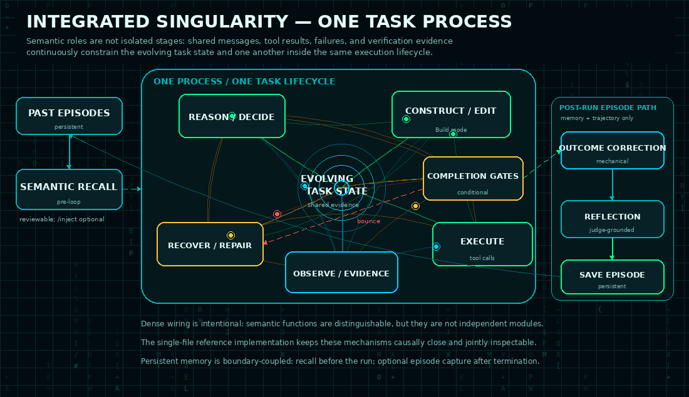
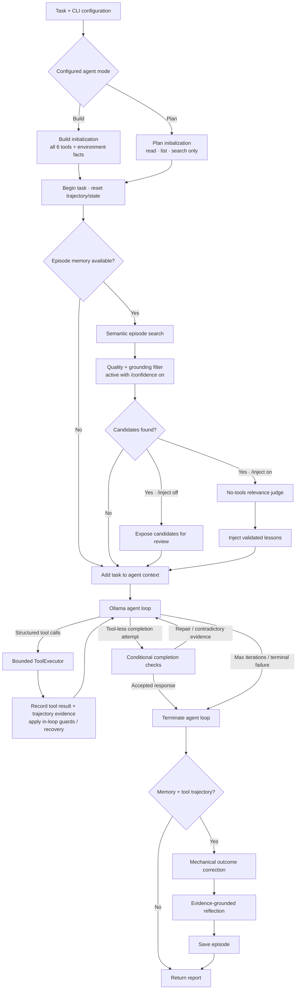
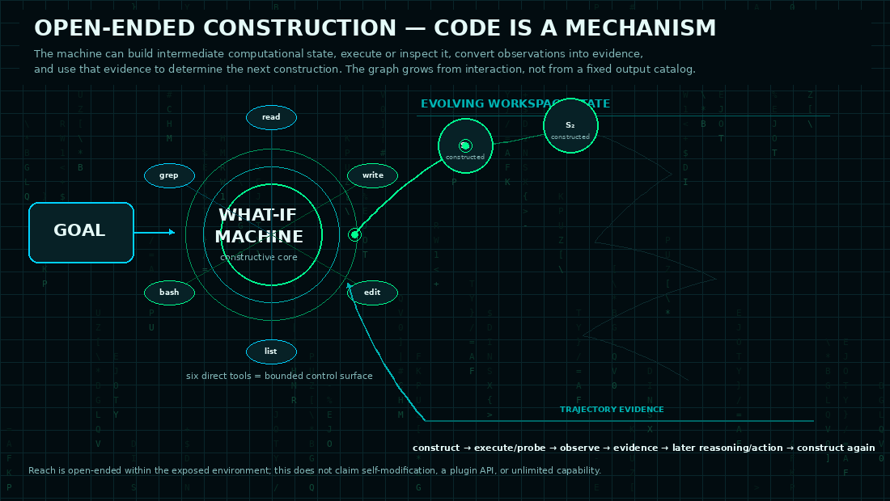

<div align="center">

  

  # What-If Machine

  **Local AI engineering that treats evidence—not confidence—as completion.**

  A Windows-first, evidence-carrying constructive reasoning system for Ollama that can plan, create, execute, observe, diagnose, repair, verify, and iteratively refine computational solutions inside a controlled workspace.

  [](https://www.python.org/)
  [](https://www.microsoft.com/windows/windows-11)
  [](https://ollama.com/)
  [](https://github.com/Astroqbit/what-if-machine/actions/workflows/bandit.yml)
  
  [](LICENSE)

  <br>

  

  [Quick start](#quick-start) · [How it works](#how-it-works) · [Verification](#verification-stack) · [Models](#model-compatibility) · [Documentation](#documentation) · [Security](SECURITY.md)

</div>

> [!NOTE]
> **Experimental portfolio release.** The runtime is under active development and full behavior depends on the selected model, local environment, dependencies, and task. It is an engineering tool—not a hardened security sandbox.

## Why it exists

Most coding agents can stop when an answer *looks* complete. What-If Machine is designed around a stricter question:

> **What evidence shows that the result actually works?**

The agent gives a local model structured tools, records what really happened, challenges weak success signals, and feeds failures back into the next iteration. The result is a repeatable **reason → construct → execute → observe → diagnose → repair → verify** loop instead of a one-shot code response.

Generated code is not necessarily the objective itself. It can also serve as executable machinery used to measure, transform, simulate, test, or construct later stages of a mission within the controlled environment.

## Highlights

| | Capability | | Capability |
|---|---|---|---|
| 🛠️ | **Build mode** constructs and modifies workspace state through structured file operations and bounded executable tooling. | 🔎 | **Plan mode** inspects projects without changing them. |
| ✅ | **Evidence-oriented verification** checks syntax, runtime behavior, coverage, assertions, and completion claims. | 🔁 | **Failure recovery** turns failed tools and tests into actionable evidence for the next pass. |
| 🧠 | **Episode memory** preserves outcomes, root causes, fixes, settings, and optional embeddings. | 🎲 | **Reproducible runs** record model, seed, temperature, token use, and Ollama version. |
| 🖥️ | **Live terminal dashboard** shows status, context use, tool history, memory, and Matrix-style activity. | 🔒 | **Workspace boundaries** add path validation, command allowlisting, timeouts, and destructive-pattern blocking. |
| 🏠 | **Local-first operation** uses an Ollama endpoint instead of requiring a hosted AI API. | 📋 | **Detailed run logs** preserve evidence that may be condensed in the live terminal. |

## How it works

<div align="center">
  
</div>

What-If Machine is not a single prompt followed by a best-effort answer. It is a bounded, evidence-carrying control loop. Before work begins, it probes the local environment and searches prior episodes for lessons; while work is running, every tool result updates a trajectory ledger; when the model tries to finish, mechanical checks compare that verdict with what actually ran.

### Integrated singularity architecture

<div align="center">
  
</div>

The reference implementation intentionally entangles reasoning, construction, execution, observation, verification, and failure recovery within one evolving task process. These functions remain semantically identifiable for analysis, but their state and effects interact through shared messages, trajectory evidence, and verification facts rather than behaving as independently deployed services. Persistent episode memory touches that same task lifecycle at its boundaries: semantic recall occurs before the iterative loop, while the current source performs evidence-grounded reflection and episode saving after termination only when memory is configured and tool trajectory evidence exists.

In this project, **singularity** is a project-specific architectural term for that integrated computational organization. It is not a claim about artificial general intelligence or the technological singularity. The single-file reference implementation preserves the system as one inspectable executable object; the artifacts it constructs are not required to share that structure.

> [!NOTE]
> The flowchart below is a semantic decomposition of the runtime. Its named stages describe responsibilities and evidence flow; they are not a requirement that the reference implementation be separated into source modules or services.



### The control loop, precisely

| Stage                 | What the current source does                                                                                                                                                                                                                                                                                                                                                                                                                                                                                | Evidence carried forward                                                                                                                                                                                                                                               |
| --------------------- | ----------------------------------------------------------------------------------------------------------------------------------------------------------------------------------------------------------------------------------------------------------------------------------------------------------------------------------------------------------------------------------------------------------------------------------------------------------------------------------------------------------- | ---------------------------------------------------------------------------------------------------------------------------------------------------------------------------------------------------------------------------------------------------------------------- |
| **Bootstrap**         | Creates separate builder and pinned judge clients, then configures the selected agent mode. **Build** receives all six tools and a one-time environment probe covering Python, available packages, the working directory, and its top-level contents. **Plan** receives only `file_read`, `list_dir`, and `grep_search` and does not run the Build environment probe.                                                                                                                                       | Selected mode and tool schemas, builder model/seed/temperature, pinned judge configuration, and—on Build runs—the probed environment facts embedded in the Build prompt.                                                                                               |
| **Recall**            | If episode memory is available, searches semantically similar episodes for up to 50 candidates. With `/confidence on`, stored candidates marked ungrounded or with recorded confidence below `0.7` are filtered; `/confidence off` makes that quality filter a no-op. Candidates remain reviewable by default. With `/inject on`, the pinned no-tools judge selects transferable lessons and only validated lessons are inserted into task context.                                                         | Candidate episodes and similarity scores remain reviewable; when injection is enabled, only judge-selected lessons are appended to the agent context.                                                                                                                  |
| **Think → act**       | Calls Ollama's `/api/chat`. Structured tool calls are dispatched through `ToolExecutor`; file operations remain workspace-bounded, while `bash` applies its command allowlist, path controls, timeouts, and destructive-pattern restrictions. Agent-level guards separately handle duplicate calls and distinguish commands that actually executed from calls that were refused or suppressed.                                                                                                              | Tool-result messages return to the model; the trajectory records tool identity, bounded argument summaries, and success state. Token counts and the review-only thinking log are retained separately.                                                                  |
| **Diagnose → repair** | Execution evidence is interpreted while the loop is still running. Tool failures, red tests, coverage gaps surfaced after a passing self-test, skipped or ineffective assertions, weakened tests, silent exception swallowing, failed-edit spirals, security-boundary hits, stalls, and protocol failures can produce bounded corrective feedback or recovery actions instead of being mistaken for progress.                                                                                               | Corrective messages plus evolving verification state: latest edits, test pass/fail ordering, script-run results, failure state, recovery state, and mutation measurements when that infrastructure is enabled.                                                         |
| **Verify completion** | A non-empty **tool-less completion attempt** enters conditional completion checks. Depending on the artifact and accumulated evidence, the runtime can challenge unverified or red-after-edit state, run a real entry-point smoke check, run mutation verification when enabled, and compare final claims against the recorded last execution of scripts the response names. A failed check feeds concrete repair evidence back into the agent loop; an accepted response terminates it.                    | Edit/test ordering, entry-smoke results, script last-run facts, claim conflicts, and mutation history when enabled remain distinct instead of collapsing into a single success flag.                                                                                   |
| **Finish → learn**    | An accepted response, terminal failure, or exhausted iteration budget ends the agent loop. When episode memory is configured **and** the run contains tool trajectory evidence, mechanical rules first correct an outcome that contradicts execution evidence; the pinned judge then generates a structured reflection with grounding/evidence checks and fallback behavior, and the resulting episode is stored. Without memory or tool trajectory evidence, the response returns without episode capture. | When an episode is stored: corrected outcome, root cause, fix, verification, confidence, grounding, trajectory, iterations, model settings, token cost, review-only thinking log, mutation history when present, and an optional embedding for future semantic recall. |


> [!IMPORTANT]
> Checks are conditional on the artifact and the evidence available in that run. Mutation-testing infrastructure exists, but the current V180 source sets `MUTATION_MAX_FIRES = 0`, so mutation rounds are disabled by default.

### Built-in tools

| Tool | Purpose | Build | Plan |
|---|---|:---:|:---:|
| `file_read` | Read a bounded section of a file | ✓ | ✓ |
| `list_dir` | Inspect workspace structure | ✓ | ✓ |
| `grep_search` | Search project text | ✓ | ✓ |
| `file_write` | Create a new file | ✓ | — |
| `str_replace` | Make a targeted edit | ✓ | — |
| `bash` | Run allowlisted developer commands | ✓ | — |

### General constructive scope

<div align="center">
  
</div>

The six built-in tools are the machine's **direct control surface**, not a catalog of the kinds of outcomes it can construct. `file_write` can create new files and nested workspace structures, while the bounded execution layer can invoke multiple available runtimes, package managers, compilers, build systems, test runners, and supporting utilities. A mission is therefore not restricted to one file, one language, one framework, or one predefined application type.

This makes the reachable construction space **open-ended within the exposed environment**. Programs, tests, tools, processes, files, data structures, interfaces, simulations, and other computational structures may be final deliverables or intermediate machinery whose outputs become evidence for later steps.

The practical boundary is the combined reach of the selected model, the six exposed tools, the command policy, installed software, workspace permissions, dependencies, hardware, and what the runtime can observe well enough to verify. The current default Build prompt remains explicitly software-development oriented; this broader statement describes the capability of the underlying construction substrate rather than claiming that V180 is domain-independent by default.

Read the deeper design notes in [Architecture](docs/ARCHITECTURE.md).

## Quick start

### 1. Install the prerequisites

- Windows 11 (primary development target)
- [Python 3.10+](https://www.python.org/downloads/)
- [Ollama](https://ollama.com/download)
- An Ollama model with reliable tool/function calling

### 2. Clone and install

```powershell
git clone https://github.com/Astroqbit/what-if-machine.git
cd what-if-machine
python -m pip install -r requirements.txt
```

### 3. Pull a model

The preferred public Ornith model is:

```powershell
ollama pull ornith:35b
```

### 4. Run the machine

Interactive Build mode:

```powershell
New-Item -ItemType Directory -Force C:\work\mission | Out-Null
python what_if_machine.py --model ornith:35b --dir C:\work\mission
```

Single-prompt mode:

```powershell
python what_if_machine.py --model ornith:35b --dir C:\work\mission "Build a small Python utility and verify it."
```

Read-only planning:

```powershell
python what_if_machine.py --agent plan --model ornith:35b --dir C:\work\mission
```

<details>
<summary><strong>CLI options</strong></summary>

| Option | Description |
|---|---|
| `prompt` | Optional prompt for non-interactive execution |
| `--model`, `-m` | Ollama model tag |
| `--agent`, `-a` | `build` or `plan` |
| `--url`, `-u` | Ollama endpoint |
| `--dir`, `-d` | Bounded working directory |
| `--temp`, `-t` | Builder temperature; default `0.6` |
| `--seed` | Reuse a recorded builder seed for a closer replay |
| `--verbose`, `-v` | Show additional diagnostic output |
| `--log FILE` | Write the uncapped run log to a chosen file |
| `--no-log` | Disable run logging |

</details>

## Verification stack

What-If Machine separates checks that are often incorrectly treated as equivalent:

| Layer | Question it answers |
|---|---|
| **Parse** | Is the file syntactically valid? |
| **Runtime** | Does the real entry point start? |
| **Self-test** | Does an explicit verification path pass? |
| **Coverage** | Did the relevant code and assertions execute? |
| **Assertion quality** | Is the test meaningful rather than decorative? |
| **Mutation** | Would selected incorrect behavior be detected? |
| **Completion ledger** | Do final claims agree with recorded execution evidence? |

No single green signal proves everything. The runtime combines multiple imperfect measurements and keeps their evidence distinct.

> [!IMPORTANT]
> Mutation-testing infrastructure is present, but mutation-gate firings are disabled by default in the current V180 source with `MUTATION_MAX_FIRES = 0`.

See [Verification Design](docs/VERIFICATION.md) and the measured [Engineering Case Studies](docs/ENGINEERING_CASE_STUDIES.md).

## Model compatibility

The runtime communicates with Ollama's `/api/chat` endpoint and supplies structured tool definitions. A suitable model must reliably follow tool schemas across long, iterative sessions.

| Family | Example Ollama tags | Position |
|---|---|---|
| **Ornith 1.5** | `ornith-1.5:35b`, `ornith-1.5:9b` | work-in-progress family |
| **Ornith 1.0** | `ornith:35b`, `ornith:9b` | Compatible Release |

These are interface-compatible candidates, not a claim that every model and quantization has been benchmarked end to end. See [Model Compatibility](docs/MODELS.md).

## Persistent data

| Path | Contents |
|---|---|
| `episodes.jsonl` | Tasks, outcomes, lessons, root causes, evidence, model settings, and optional embeddings |
| `whatif_logs/` | Uncapped run logs stored beside the runtime by default |
| Mission workspace | Files and other artifacts produced during a build |

Prompts, paths, model output, and tool evidence may appear in the episode store and logs. Both supplied runtime-data paths are excluded by `.gitignore`; still review them before sharing a workspace.

## Safety

The project contains engineering guardrails, not an operating-system security boundary. Commands and generated programs inherit the permissions of the account running What-If Machine.

1. Run each mission in a dedicated workspace.
2. Keep credentials and private files outside that workspace.
3. Use version control or backups for important projects.
4. Use a disposable VM or container for untrusted code, packages, prompts, or models.
5. Review dependency-install commands in sensitive environments.

Read the full [Security Policy](SECURITY.md).

## Project status

| | Current state |
|---|---|
| Maturity | Experimental portfolio release |
| Primary platform | Windows 11 |
| Interface | Python CLI with a Rich live dashboard and plain-terminal fallback |
| Runtime | Local or reachable Ollama endpoint |
| Verification | Multi-layer checks; task- and environment-dependent |

<details>
<summary><strong>Known limitations and active cleanup</strong></summary>

- Some displayed version labels and documentation are not yet synchronized with the V180 source header.
- Theme colors, terminal sizing, and border behavior may vary with terminal configuration.
- Some documented or planned features may not yet be wired through every execution path.
- Long model sessions can time out, and dependencies vary by generated project.
- Model behavior is not uniform even when the Ollama interface reports tool support.
- Full model-driven verification depends on the task, generated artifact, local dependencies, and available hardware.

</details>

## Documentation

| Document | What it covers |
|---|---|
| [Architecture](docs/ARCHITECTURE.md) | Runtime components, tools, memory, logging, and data flow |
| [Verification Design](docs/VERIFICATION.md) | Verification layers and their limits |
| [Engineering Case Studies](docs/ENGINEERING_CASE_STUDIES.md) | Observed failure modes and measured repairs |
| [Model Compatibility](docs/MODELS.md) | Model families, Ollama tags, endpoints, and reproducibility |
| [GitHub Setup](docs/GITHUB_SETUP.md) | Repository setup notes |
| [Security Policy](SECURITY.md) | Threat model and safe-use guidance |

## Contributing

Bug reports and reproducible failure cases are welcome. When reporting a model-driven issue, include the model tag, Ollama version, command, relevant run-log excerpt, and the smallest workspace that reproduces the behavior.

Because this is proprietary software, do not submit code or documentation changes unless Matthew Newland has approved the contribution in writing. See [Contributing](CONTRIBUTING.md) for the ownership policy.

[Open an issue](https://github.com/Astroqbit/what-if-machine/issues/new) · [View the source](what_if_machine.py)

## License

Copyright © 2026 Matthew Newland. All rights reserved.

What-If Machine is **proprietary, source-available software**, not open-source software. No permission is granted to use, copy, modify, distribute, sublicense, sell, host, or create derivative works except under a separate written agreement from the copyright owner. See the [Proprietary License](LICENSE).

## Author

**Matthew Newland** · Technical Research · AI Systems · Verification · QA · Python

If this project is useful, consider [starring the repository](https://github.com/Astroqbit/what-if-machine) so others can find it.
